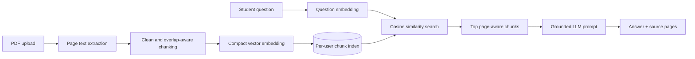

# Nustudy AI

> **Your AI-powered study companion for smarter learning.**

Nustudy AI is a personal, authenticated study dashboard for turning PDF lecture notes, handouts, and readings into searchable learning material. A student uploads a text-based PDF, then uses the same private source library to ask cited questions, create revision notes, generate multiple-choice quizzes, and retain quiz history.

> **Design principle:** the assistant should answer from the student’s uploaded sources, not from unsupported outside knowledge. When relevant material is not retrieved, it responds: “I couldn't find this information in the uploaded documents.”

## Product Preview

| Nustudy AI Dashboard | Grounded Ask Workspace |
| --- | --- |
|  |  |

More working-screen captures are listed in [`docs/github-and-linkedin-kit.md`](docs/github-and-linkedin-kit.md).

## What It Does

Nustudy AI keeps the learning workflow deliberate and explainable. The Library accepts one PDF at a time with server-side validation, a 20 MB size limit, status feedback, searchable passages, and source deletion. The Ask workspace retrieves the most relevant indexed chunks before the model responds, then attaches each answer to the document and page it used. Summaries creates saved short, medium, or detailed summaries and key-concept notes. Quizzes builds source-only MCQs, records selections, shows explanations, and saves quiz-attempt history in Progress.

| Workspace | Working capability |
| --- | --- |
| **Overview** | Displays live document, question, quiz, and average-score metrics from the signed-in user’s data. |
| **Library** | Uploads, extracts, chunks, indexes, lists, searches, opens source PDFs, and deletes user-owned documents. |
| **Ask** | Retrieves relevant PDF passages, generates a source-grounded answer, keeps session history, links citations, copies answers, and clears the conversation. |
| **Summaries** | Produces and saves source-only summaries or key-concept notes for a selected document. |
| **Quizzes** | Generates 5, 10, or 20 source-only MCQs, guides the student through answers, scores attempts, shows explanations, and supports retrying. |
| **Progress** | Preserves every submitted quiz result and calculates current average and best score. |

## Why RAG Is Used

A large PDF should not be copied in full into an LLM request for every question. That approach is slow, expensive, and gives weak traceability. Instead, Nustudy AI uses a retrieval-augmented generation (RAG) flow: it represents the question and chunks as compact vectors, searches the signed-in user’s own index, sends only the best matching passages to the LLM, then returns answer citations.



The implementation is intentionally suitable for a university AI project. Each stored chunk contains the original page number, chunk number, text, and vector. Retrieval uses cosine similarity, then applies an overlap safeguard before generation. The LLM system instruction explicitly bans outside knowledge and directs the model to return the no-information response when the supplied context is insufficient.

## Architecture and Data Model

The application is a single, readable full-stack project rather than a microservice system. React and Tailwind provide the responsive interface. Express and tRPC expose typed server procedures. MySQL/TiDB stores user metadata and study records; object storage holds PDF bytes; the built-in server-side LLM proxy generates answers, notes, and strictly structured quiz JSON. User authentication is provided by the project’s OAuth scaffold.

| Layer | Main responsibility | Key project locations |
| --- | --- | --- |
| Frontend | Authenticated dashboard, responsive study workspaces, loading/error/empty states | `client/src/pages/`, `client/src/components/` |
| Application API | Validated user-owned procedures and private data access | `server/routers.ts`, `server/db.ts` |
| PDF pipeline | Page-level extraction and text cleaning | `server/services/pdf.ts` |
| Retrieval | Chunking, vector construction, cosine similarity, query-overlap safeguard | `server/services/retrieval.ts` |
| AI generation | Grounded answers, summaries, key-concept notes, structured MCQs | `server/services/studyAi.ts` |
| Quiz logic | Deterministic answer grading and feedback | `server/services/quiz.ts` |
| Persistence | Documents, chunks, messages, notes, quizzes, and attempts | `drizzle/schema.ts`, `drizzle/` |

The important database records are `documents`, `documentChunks`, `chatMessages`, `studyNotes`, `quizzes`, and `quizAttempts`. Every data operation filters by the authenticated `userId`, so a user can only retrieve, generate from, or delete their own study material.

## Technology Choices

| Technology | Why it is used |
| --- | --- |
| React 19 + TypeScript | A typed, maintainable user interface that is straightforward to explain. |
| Tailwind CSS + shadcn/ui | Responsive, accessible components and a polished dashboard visual system. |
| Express 4 + tRPC 11 | Typed client-server contracts without introducing a separate REST layer. |
| Drizzle ORM + MySQL/TiDB | Simple relational persistence for structured study records and per-user access checks. |
| `pdf-parse` | Server-side PDF text extraction with page-aware output. |
| Feature-hashed vector embeddings + cosine similarity | A compact, transparent local vector index appropriate for student-scale document collections. |
| Server-side LLM proxy (`gpt-5-mini`) | Real LLM calls for grounded Q&A, study notes, and strict JSON quiz output; keys are never exposed to the browser. |
| S3-compatible object storage | Stores the original PDF outside the database, with only metadata and storage keys persisted. |

## Local Installation

This repository is a Node.js/TypeScript application, so it uses `package.json` and `pnpm` rather than Python’s `requirements.txt`.

| Requirement | Suggested version |
| --- | --- |
| Node.js | 22 or later |
| pnpm | 10 or later |
| MySQL or TiDB | A reachable development database |
| OAuth, storage, and LLM proxy credentials | Required for a fully standalone local run |

First clone the repository and install the dependencies.

```bash
git clone <your-repository-url>
cd nustudy-ai
pnpm install
```

Copy the safe environment reference, create a private `.env` file locally, and replace every placeholder with your own values. The reference is intentionally kept in documentation rather than containing real credentials.

```bash
cp docs/local-environment-template.md /tmp/nustudy-ai-env-reference.md
# Create .env in the repository root from the dotenv block in the reference file.
# Never commit .env.
```

Create the schema, then start the local development server.

```bash
pnpm drizzle-kit generate
pnpm drizzle-kit migrate
pnpm dev
```

For a normal development database refresh, the project also provides:

```bash
pnpm db:push
```

Open the local URL printed by the server. The standard validation commands are below.

```bash
pnpm check
pnpm test
pnpm build
```

## API-Key and Secret Handling

The browser never receives the LLM or storage keys. In the managed project, the following server-side values are injected automatically: `BUILT_IN_FORGE_API_URL`, `BUILT_IN_FORGE_API_KEY`, `DATABASE_URL`, and the OAuth variables. For an independent local deployment, create `.env` from [`docs/local-environment-template.md`](docs/local-environment-template.md). Do not commit `.env`, database credentials, OAuth secrets, or provider tokens. The repository’s `.gitignore` excludes common environment-file names.

## Upload to GitHub

Create an empty repository on GitHub without adding a second README, license, or `.gitignore`, then run these commands from the project directory. Replace the repository URL with your own GitHub URL.

```bash
git init
git add .
git status                         # review the files before committing
git commit -m "Prepare Nustudy AI for GitHub"
git branch -M main
git remote add origin https://github.com/YOUR_USERNAME/YOUR_REPOSITORY.git
git push -u origin main
```

Before pushing, confirm that no `.env` file, API key, private key, database export, or generated `dist/` directory appears in `git status`. If a secret has ever been committed, remove it from the repository history and rotate it before publishing.

The repository includes `LICENSE`, `.gitignore`, `pnpm-lock.yaml`, the public environment reference, testing notes, and a GitHub Actions workflow at `.github/workflows/quality.yml`. The workflow runs `pnpm install --frozen-lockfile`, `pnpm check`, and `pnpm build` on pushes and pull requests. Full integration tests require configured database, authentication, storage, and LLM services, so they are intentionally run locally or in a separately configured environment.

## Production Deployment

Nustudy AI is a Node.js application that requires a persistent MySQL/TiDB database, an OAuth provider, server-side LLM access, and S3-compatible object storage for uploaded PDFs. Use a Node.js hosting service that supports a long-running Express process and environment variables. The managed Nustudy AI deployment already supplies these services; an independent deployment must provide equivalent services.

Set the production environment variables before starting the application. At minimum, configure `DATABASE_URL`, `JWT_SECRET`, `VITE_APP_ID`, `VITE_OAUTH_PORTAL_URL`, `OAUTH_SERVER_URL`, `BUILT_IN_FORGE_API_URL`, and `BUILT_IN_FORGE_API_KEY`. Configure the OAuth provider’s callback URL to point to `/api/oauth/callback` on the deployed HTTPS domain. Keep `BUILT_IN_FORGE_API_KEY`, `DATABASE_URL`, and `JWT_SECRET` server-side and never expose them in client code or GitHub Actions logs.

After installing dependencies, apply the schema and build the application. The production process is the `start` script, and the hosting provider should route external HTTPS traffic to the port supplied by the runtime rather than hard-coding a local port.

```bash
pnpm install --frozen-lockfile
pnpm drizzle-kit generate
pnpm drizzle-kit migrate
pnpm build
pnpm start
```

The deployment must preserve access to the configured S3-compatible storage so users can upload and delete PDFs, and it must use HTTPS so OAuth cookies and callback redirects work correctly. Before announcing a deployment, sign in, upload a text-based PDF, ask a cited question, generate notes, complete a quiz, and verify that the result appears in Progress.

## How to Demonstrate the Project

Start by signing in and uploading a normal, text-based lecture PDF in Library. Wait for the processing message to finish, then use Ask to enter a focused question such as “What are the main reasons for normalisation?” Verify the returned document-page citations. Next, create a medium summary and key-concept notes in Summaries. Finally, generate a five-question quiz, submit every answer, inspect the explanation cards, and open Progress to see the saved score.

## Testing Completed

The automated test suite contains authentication behavior, retrieval/vector behavior, quiz scoring, a database-persistence test, and an educational-PDF integration test. The educational test downloads a public 15-page database-normalisation lecture PDF, extracts its pages, creates the retrieval chunks, retrieves page-aware context, invokes grounded answer generation, creates a summary, and creates five valid MCQs. The persistence test creates a private document index and quiz attempt, then verifies that deleting the source removes its chunks and related quiz history. The final suite and production build both completed successfully.

| Check | Result |
| --- | --- |
| TypeScript validation | `pnpm check` passed. |
| Unit tests | Retrieval chunking/similarity and deterministic quiz grading passed. |
| Authentication test | Sign-out cookie behavior passed. |
| Real educational-PDF flow | Extraction, retrieval, grounded answer, summary, and five-MCQ generation passed. |
| Persistence and deletion flow | Indexed chunks and quiz attempts were saved, then removed when the source document was deleted. |
| Production build | `pnpm build` passed. |
| Responsive review | Library, Ask, Quizzes, and Progress were reviewed at desktop, tablet, and mobile widths. |
| GitHub quality workflow | `.github/workflows/quality.yml` runs type-checking and the production build. |

## Known Limitations

The first version focuses on text-based PDFs. Scanned pages that have no embedded text are rejected rather than silently producing poor retrieval results; OCR can be added later. Vector records are stored as JSON in the relational database, which is easy to explain and appropriate for a student-scale library, but a dedicated vector database becomes preferable for thousands of large documents. AI generation requires a configured server-side model proxy and consumes model credits. The project deliberately keeps its scope to single-user study workflows rather than collaboration, sharing, or background ingestion queues.

## Future Improvements

Future work can add OCR for scanned notes, a selectable external embedding provider, streaming answers, document-page highlights, flashcards, a conversational history grouped by study session, richer analytics, and exports of summaries or quiz results. A production-scale revision could migrate the JSON vectors to FAISS, ChromaDB, or a hosted vector service while keeping the same page-aware chunk model and grounded prompting contract.

## References

The public lecture material used for the integration test is cited here for reproducibility.

[1] [Database Normalisation lecture notes — Michael Jacobs](https://lse-me314.github.io/other_resources/database_normalisation_notes.pdf)
